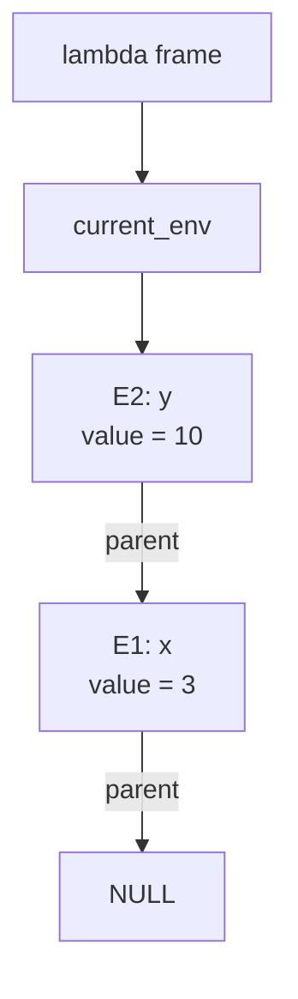

# Lambda

Scala 3 で実装された、小さな型付きラムダ計算系言語のコンパイラです。
`main.lam` を読み込み、型検査を行ったうえで ARM64 向けのアセンブリを `build/out.s` に生成します。

## できること

- 単純型付きラムダ抽象 `λx: T. ...`
- 型抽象 `ΛA. ...`
- 型適用 `f[T]`
- 型別名 `type X[T] = ... in ...`
- データ型定義 `data X[T] = | XA | XB(T) in ...`
- データ型のパターンマッチ `match x with | XA → ... | XB(t) -> ...`
- 関数適用 `f(x)`
- Unit 引数の関数定義・適用 `f()`
- ブロック式 `{ expr; ...; result }`
- 変数束縛 `let x: T = ... in ...`
- 関数束縛 `let f[A](x: T)(y: U): R = ... in ...`
- 再帰束縛 `let rec f: T = ... in ...`
- 再帰関数束縛 `let rec f(x: T): R = ... in ...`
- 外部 C 関数の参照 `foreign[T → U] name`
- 整数リテラル `0`, `2`, `11`
- 文字リテラル `'a'`, `'z'`
- 文字列リテラル `"hello"`
- 真偽値リテラル `true`, `false`
- ユニットリテラル `()`
- 整数・文字に対する単項 `-`
- 二項演算 `+`, `-`, `*`, `/`
- 比較演算 `==`, `!=`, `<`, `<=`, `>`, `>=`
- `if ... then ... else ...`
- クロージャと環境フレームを使った変数キャプチャ

## 型

現在サポートしている型は次のとおりです。

```text
Int
Char
String
Bool
Unit / ()
T → U
∀A. T
F[T]
```

`λ`、`let`、`let rec` では型注釈が必須です。  
多相関数は `ΛA. ...` で型抽象し、`f[Int]` のように明示的に型適用します。  
型別名は `type Option[A] = ... in ...` のように定義でき、 `Option[Int]` のように単項の型適用を連ねます。  
複数引数の型別名は `type Result[A][E] = ...`、利用側は `Result[Int][Char]` です。
あくまでも型別名であり、`Result[Int]`のように利用することは出来ません。  
データ型も `data Option[A] = ... in ...` のように `in` 付きのスコープで定義します。型別名と違い、データ型は透明には展開されない名目的な型です。
コンストラクタは通常の値として導入され、型引数は明示的に適用します。たとえば `None[Int]` や `Some[Int](42)` のように書きます。  
ブロック式は `{ expr; ...; result }` のように書き、セミコロン付きの式を順に評価して捨て、最後の式をブロック全体の結果にします。
最後の式を省略した空ブロックや副作用だけのブロックの結果は `Unit` です。  

```ocaml
λx: Int. x + 1

let x: Int = 3 in
x + 10

let rec f: Int → Int = λn: Int. if n <= 0 then 0 else f(n - 1) in
f(10)

let id: ∀A. A → A = ΛA. λx: A. x in
id[Int](42)

type Option[A] = ∀R. R → (A → R) → R in
let none[A]: Option[A] =
  let run[R](fst: R)(snd: A → R): R = fst in
  run
in
none[Int]
```

## データ型と match

`data` では複数のコンストラクタと、それぞれのフィールド型を定義できます。

```ocaml
data Option[A] =
  | None
  | Some(A)
in

let value: Option[Int] =
  Some[Int](42)
in

match value with
  | None -> 0
  | Some(n) -> n
```

コンストラクタの型は、定義した型パラメータを持つ通常の関数として扱われます。

```text
None : ∀A. Option[A]
Some : ∀A. A → Option[A]
```

複数フィールドのコンストラクタはカリー化された関数になります。

```ocaml
data Pair[A][B] =
  | Pair(A)(B)
in
Pair[Int][String](1)("x")
```

`match` は対象のデータ型の全コンストラクタを網羅する必要があります。
各分岐の束縛数はコンストラクタのフィールド数と一致している必要があり、すべての分岐の結果型も一致している必要があります。
現在はネストパターン、ワイルドカード、guard、部分的な `match` はありません。

```ocaml
let unwrapOrZero(option: Option[Int]): Int =
  match option with
    | None -> 0
    | Some(n) -> n
in
unwrapOrZero(Some[Int](42))
```

データ型は型検査上は opaque な名目的型ですが、現在のバックエンドでは Generator に渡す前に Church encoding へ変換しています。
そのためユーザーコードから `Option[Int]` を直接 `∀R. R → (Int → R) → R` として呼び出すことはできません。
また、現時点では自身を直接フィールドに含む再帰データ型は Church encoding の対象外です。

関数束縛、再帰関数束縛は糖衣構文になっています。  

## 糖衣構文

```ocaml
let choose[A](x: A)(y: A): A = x in
choose[Int](1)(2)
```

これは既存の `let` / `let rec` と `λ` / `Λ` に変換されます。

```ocaml
let choose: ∀A. A → A → A =
  ΛΑ. λx: A. λy: A. x
in
choose[Int](1)(2)
```

外部 C 関数を使う場合は `foreign[T → U] name` のように型を書き、
一変数の関数しか置くことができません。また、
この型注釈は C 側の実装が従うものとして信頼します。

```ocaml
let puts: String → Int = foreign[String → Int] puts in
puts("hello")
```

比較演算の結果は `Bool` です。`if` の条件には `Bool` が必要です。

## 実行方法

`run.sh` は次の手順をまとめて実行します。

1. `main.lam` をパースする
2. 型検査を行う
3. `data` / `match` を Church encoding へ変換する
4. `build/out.s` を生成する
5. `clang` で実行ファイルを作成する
6. 実行して終了コードを表示する

```bash
./run.sh
```

必要なもの:

- sbt
- clang
- ARM64 macOS 向けにビルドできる環境

## 入力例

`main.lam` には、たとえば次のような式を書けます。

```ocaml
let print: Int → Int = foreign[Int → Int] print_int in
let puts: String → Int = foreign[String → Int] puts in

data Option[A] =
  | None
  | Some(A)
in

let printOption(option: Option[Int]): Int =
  match option with
    | None -> puts("None!")
    | Some(n) -> print(n)
in

printOption(Some[Int](42))
```

この例では、`Option[Int]` の値を `match` で分岐し、`Some` の中身を `print_int` 経由で表示します。

## クロージャと環境

この実装では、関数値をコードポインタと環境ポインタを持つクロージャとして扱います。
束縛された値は環境フレームに積まれ、ラムダ本体から外側の変数を参照できます。

概念的には次のような構造です。

```c
struct Env {
    Value value;
    Env *parent;
};

struct Closure {
    Value (*code)(Closure *self, Value arg);
    Env *env;
};
```

たとえば次の式では、`f` のクロージャが外側の `x` を捕捉します。

```ocaml
let x: Int = 3 in
let f(y: Int): Int = x + y in
f(10)
```

環境フレームは概ね次のようにつながります。


