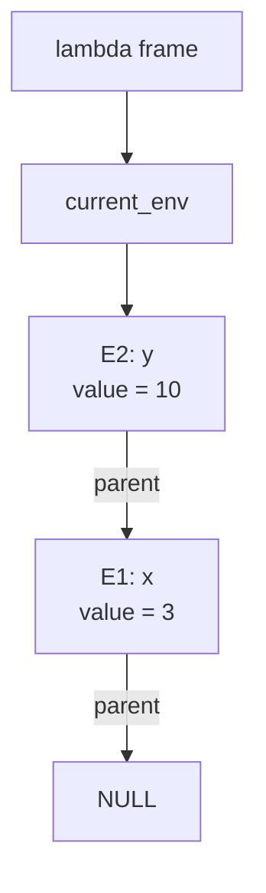

# Lambda

Scala 3 で実装された、小さな単純型付きラムダ計算系言語のコンパイラです。
`main.lam` を読み込み、型検査を行ったうえで ARM64 向けのアセンブリを `build/out.s` に生成します。

## できること

- 単純型付きラムダ抽象 `λx: T. ...`
- 関数適用 `f(x)`
- `let x: T = ... in ...`
- 再帰束縛 `let rec f: T = ... in ...`
- 外部 C 関数の参照 `foreign name`
- 整数リテラル `0`, `2`, `11`
- 文字リテラル `'a'`, `'z'`
- 真偽値リテラル `true`, `false`
- 整数・文字に対する単項 `-`
- 二項演算 `+`, `-`, `*`, `/`
- 比較演算 `==`, `!=`, `<`, `<=`, `>`, `>=`
- `if ... then ... else ...`
- クロージャと環境フレームを使った変数キャプチャ

## 型

現在サポートしている型は次のとおりです。

```text
Int
Char
Bool
T → U
```

`λ`、`let`、`let rec` では型注釈が必須です。

```text
λx: Int. x + 1

let x: Int = 3 in
x + 10

let rec f: Int → Int = λn: Int. if n <= 0 then 0 else f(n - 1) in
f(10)
```

`foreign name` は現状 `Int → Int` として扱われます。`runtime/ffi.c` には `print_int` と `put_char` が用意されています。

```text
let print: Int → Int = foreign print_int in
print(42)
```

比較演算の結果は `Bool` です。`if` の条件には `Bool` が必要です。

## 実行方法

`run.sh` は次の手順をまとめて実行します。

1. `main.lam` をパースする
2. 型検査を行う
3. `build/out.s` を生成する
4. `clang` で実行ファイルを作成する
5. 実行して終了コードを表示する

```bash
./run.sh
```

必要なもの:

- sbt
- clang
- ARM64 macOS 向けにビルドできる環境

## 入力例

`main.lam` には、たとえば次のような式を書けます。

```text
let print: Int → Int = foreign print_int in
let rec loop: Int → Int → Int =
  λn: Int.
  λacc: Int.
    if n <= 0 then acc else loop(n - 1)(acc + n)
in
print(loop(100)(0))
```

この例では、`loop` が `1` から `100` までの合計を計算し、`print_int` 経由で結果を表示します。

## クロージャと環境

この実装では、関数値をコードポインタと環境ポインタを持つクロージャとして扱います。
束縛された値は環境フレームに積まれ、ラムダ本体から外側の変数を参照できます。

概念的には次のような構造です。

```c
struct Env {
    Value value;
    Env *parent;
};

struct Closure {
    Value (*code)(Closure *self, Value arg);
    Env *env;
};
```

たとえば次の式では、`f` のクロージャが外側の `x` を捕捉します。

```text
let x: Int = 3 in
let f: Int → Int = λy: Int. x + y in
f(10)
```

環境フレームは概ね次のようにつながります。


