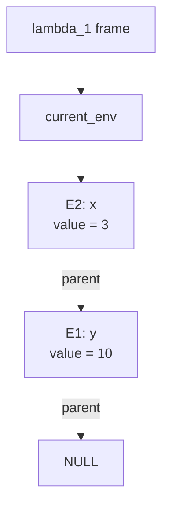

# Lambda

Scala 3 で実装された、小さなラムダ計算系言語のコンパイラです。`main.lam` を読み込み、ARM64 向けのアセンブリを `build/out.s` に生成します。

## できること

- ラムダ抽象 `λx. ...`
- 関数適用 `f(x)`
- `let ... in ...`
- `if ... then ... else ...`
- 整数演算 `+`, `-`, `*`, `/`
- 比較演算 `==`, `!=`, `<`, `<=`, `>`, `>=`
- クロージャと環境フレームを使った変数キャプチャ

## 実行方法

`run.sh` は次の手順をまとめて実行します。

1. `main.lam` をパースして `build/out.s` を生成
2. `clang` で実行ファイルを作成
3. 実行して終了コードを表示

```bash
./run.sh
```

## クロージャと環境

この実装では、クロージャと環境を概ね次のような構造として扱います。

```c
struct Env {
    Value value;
    Env *parent;
};

struct Closure {
    Value (*code)(Closure *self, Value arg);
    Env *env;
};
```
## 入力例

`main.lam` には、たとえば次のような式を書けます。

```text
let x = 3 in
let f = λy. x + y in
f(10)
```
`lambda_1` が `x = 3` を現在のフレームに持ち、その親フレームが `y = 10` を保持している状態は、次の Mermaid 図で表せます。




